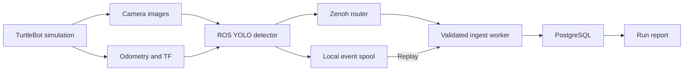

# TurtleBot Semantic Maze Explorer

My robot moves between predefined locations in a simulated maze, identifies objects using its camera, and records what it sees along with its position and the image timestamp. It can also search for a chosen object.

My project connects robot navigation and visual perception with a durable record of what the robot observes. It extends a TurtleBot maze simulation with semantic objects and implements a pipeline that detects objects from the robot camera, associates each observation with the robot's state at image time, and stores the results in PostgreSQL through Zenoh.

## Problem statement

A robot's object detections are more useful when they retain the context of the observation: where the robot was, how it was moving, which camera frame produced the image, and when the image was captured. Saving only a class label or using the robot's position after inference loses that context. Messaging interruptions can also leave gaps in the recorded observations.

This project addresses those problems through timestamp alignment, structured detection events, transactional storage, and replay of locally saved events. The current focus is simulation and reliable perception records, providing a foundation for semantic exploration.

## What the robot does

The project implements the following robot capabilities:

- **Navigates autonomously to configured destinations:** Nav2 plans and follows paths to goal poses, while behavior trees select locations from a predefined list.
- **Searches for a target object:** the search behaviors combine navigation to configured locations with camera checks for a chosen color or YOLO object class.
- **Detects and describes visible objects:** YOLO extracts class labels, confidence scores, and bounding boxes from camera images.
- **Records the context of each observation:** the event detector attaches image metadata, an image hash, robot position, heading, velocities, and the available camera transform. State alignment uses the image timestamp.
- **Publishes and stores observations:** Zenoh carries structured events to an ingest worker that validates and saves each frame and its detections atomically in PostgreSQL.
- **Recovers saved observations:** the detector writes events locally before publication, and replay restores records without duplicating identical events.
- **Builds a semantic graph:** the graph-builder component clusters observation locations into places and fuses object observations into landmarks using spatial proximity and CLIP embedding similarity. It stores place and object relationships in Apache AGE.
- **Produces observation reports:** the reporting component summarizes frame counts, class histograms, missing sequences, and camera-transform availability.
- **Visualizes navigation and sensor data:** Gazebo displays the simulated robot and environment; RViz2 displays maps, robot state, sensor streams, and navigation paths.

The semantic maze contains three benches touching its walls and nine procedural objects. Each bench has a distinct COCO-class object set drawn from cups, bottles, books, bowls, a laptop, a mouse, and a vase.

## Technologies used

| Technology | Role in the project |
| --- | --- |
| ROS 2 Jazzy and Cyclone DDS | Robot nodes, topics, sensor communication, and middleware |
| TurtleBot3, Gazebo Harmonic, SDF and Xacro | Robot simulation, maze geometry, and reproducible object placement |
| Nav2 and RViz2 | Navigation, localization, and visualization in the existing simulation stack |
| Python and C++ | Perception and storage code, plus existing autonomy components |
| Ultralytics YOLOv8 and PyTorch | Object detection with a CUDA-enabled runtime configuration |
| OpenCV and cv_bridge | Converting ROS camera images for inference |
| TF2 | Looking up the camera transform at image time |
| Eclipse Zenoh | Publishing detection events and run metadata |
| PostgreSQL, Apache AGE and psycopg2 | Relational event storage, semantic property graphs, transactions, and reporting |
| CLIP embeddings and online DBSCAN | Object-observation fusion and clustering observation locations into places |
| py_trees and BehaviorTree.CPP | Navigation and object-search behavior trees |
| Docker and Docker Compose | Packaging dependencies and configuring simulation, detection, messaging, and storage services |
| pytest | Event-contract, synchronization, geometry, and integration tests |
| Git | Tracking implementation changes and project documentation |

My target environment is Ubuntu 24.04 on an AWS EC2 g4dn.2xlarge instance with an NVIDIA T4. The graphical workflow is prepared around Amazon DCV, with NVIDIA Container Toolkit for container GPU access.

## Skills learnt

Through the implementation and local verification, I developed skills in:

- Understanding ROS nodes, topics, sensor QoS, and the relationship between simulation and robot data.
- Designing sensor observations around image timestamps rather than inference completion time.
- Interpolating planar odometry, handling yaw wrapping, and preserving coordinate-frame consistency.
- Representing camera transforms and handling missing metadata without inventing values.
- Designing versioned event contracts with UUIDs, sequence numbers, validation, and image hashes.
- Building atomic database writes and using constraints to make replay safe.
- Separating messaging delivery from durable storage and recovering records from local event spools.
- Testing data contracts, database rollback, duplicate handling, and real messaging integration.
- Organizing a containerized robotics pipeline and documenting its requirements and verification limits.

## Project structure and data flow

Part 1 establishes the simulation environment and ROS inspection workflow. Part 2 adds semantic assets and the perception-to-database pipeline.

The Part 2 detector subscribes directly to ROS images and state, then publishes JSON over native Zenoh. It does not require a DDS-to-Zenoh bridge. The repository also retains a separate bridge-based detector used by the existing behavior demos; its `tb/detections` envelopes also supply the semantic graph builder with observations and embeddings.

Detection keys follow `maze/<robot_id>/<run_id>/detections/v1/<event_id>`. Run metadata uses `maze/<robot_id>/<run_id>/runmeta/v1`. PostgreSQL separates frame records in `detection_events` from individual object observations in `detections`, with run metadata in `detection_runs`.

## Repository layout

| Path | Contents |
| --- | --- |
| `tb_worlds/` | Simulation worlds, robot descriptions, models, maps, and launch configuration |
| `tb_autonomy/` | Existing ROS navigation and vision behaviors in Python and C++ |
| `detector/ros_event_detector.py` | ROS camera detection and timestamp-aligned event publishing |
| `detector/events/` | Event contracts, state interpolation, transactional writes, and tests |
| `detector/event_ingest.py` | Zenoh subscription, validation, failure logging, and replay |
| `detector/event_report.py` | Reports generated from stored observations |
| `detector/graph_builder.py` | Constructing semantic place and object graphs in Apache AGE |
| `detector/landmark_fusion.py` | Fusing object observations using spatial and embedding similarity |
| `detector/online_dbscan.py` | Clustering observation locations into places |
| `db/detection_events.sql` | Frame, detection, and run-metadata tables |
| `tools/` | Semantic world generation and geometry verification |
| `compose.events.yaml` | Part 2 runtime services |
| `docker-compose.yaml` | Existing simulation, behavior, and extension services |
| `docker/` | Container images and entrypoints |
| `world_assets.md` | Bench poses, object sets, and geometry details |
| `Writeup/` | Project goals, execution procedure, progress, and challenges |

## Runtime and configuration

The Part 2 stack contains `events-world`, `events-detector`, `events-router`, `events-db`, and `events-ingest`. It has explicit GPU reservations for simulation and detection, a subscriber readiness check, and persistent database and model volumes.

The initial detector configuration uses YOLOv8n, confidence 0.35, a maximum processing rate of five frames per second, `/camera/color/image_raw`, `/odom`, and `base_footprint`. These are starting settings rather than measured optimal values. `EVENT_DB_PASSWORD` supplies database credentials, and the world and detector share `ROS_DOMAIN_ID`.

Generated spools, run metadata, failure records, and reports are stored in `outputs/part2/`, which is ignored by Git. Database records persist in a Docker volume. Reports count detections across frames; they do not estimate the number of unique physical objects or model accuracy.

The complete setup, execution, recovery, testing, and shutdown commands are maintained in my local `Writeup/logs.txt`. That file is intentionally ignored by Git. The tracked documentation includes [project goals](Writeup/Tasks.txt), [implementation progress](Writeup/progress%20logs.txt), [challenges](Writeup/challenges.txt), [world assets](world_assets.md), and [verification details](docs/part2/run_report.md).

## Automated verification

Seventeen local tests passed: twelve for event contracts and odometry alignment, four using real PostgreSQL, and one for bench geometry and wall contact. The database tests include real Zenoh delivery, duplicate and identity-conflict handling, rollback when a child insert fails, empty frames, run metadata, and report counts. Python syntax checks, Xacro expansion, and Compose configuration validation also passed.

The tests use synthetic event fixtures to check event contracts and storage behavior reproducibly.

The simulation targets ROS 2 Jazzy and Gazebo Harmonic. Simulated image timestamps are retained in the raw event; the SQL timestamp represents simulation time relative to the Unix epoch rather than the recording's wall-clock time.

## Existing simulation and extension components

The repository retains the original maze, an enhanced maze, and house, bookstore, and warehouse environments. Existing behavior demos support HSV color detection and a separate YOLO pipeline, using `py_trees` or BehaviorTree.CPP.

Additional components include stella_vslam, JSONL recording, embedding ingestion, semantic graph construction, Foxglove visualization, and rosbridge integration. These remain available in the repository, but they are outside the seventeen-test verification described above. The [3D Gaussian Splatting notes](docs/3dgs-turtlebot.md) describe another reconstruction workflow.

## Acknowledgements and license

This project builds on the [TurtleBot maze repository](https://github.com/pantelis/turtlebot-maze) and Sebastian Castro's [TurtleBot behavior demos](https://github.com/sea-bass/turtlebot3_behavior_demos). My current extension adds the semantic bench world and the timestamp-aligned detection-event pipeline with transactional storage, replay, and verification.

The original code's copyright and MIT license are preserved in [LICENSE](LICENSE). Bundled third-party simulation assets retain their respective licenses.
